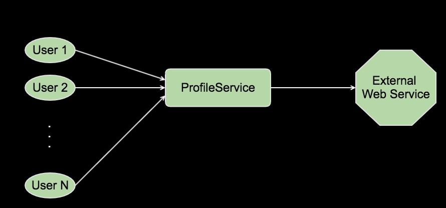
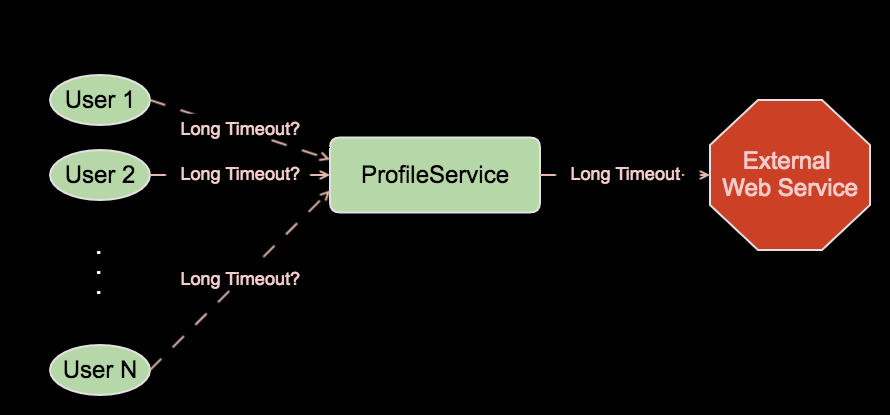
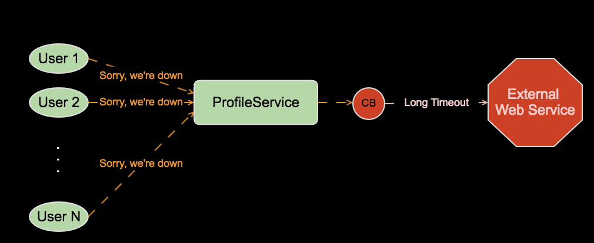
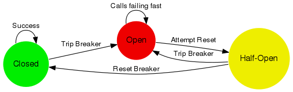
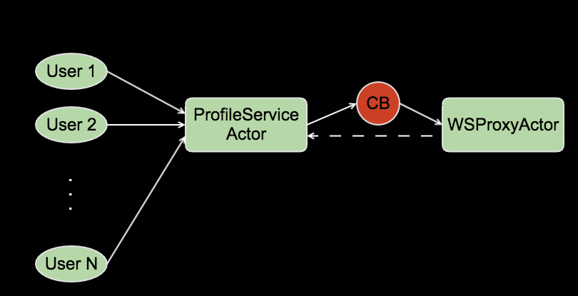

autoscale: true
build-lists: true


# Akka Circuit Breakers

## Alejandro Lujan

---


# Who Am I?

- Typesafe => Lightbend fan for ~6 years
  - Developer, Trainer, Mentor
  - Scala, Akka, Play, *Lagom*
-  Scala Up North organizer 
- Java dev / architect for 10 years
- Other stuff: C#, C++, <sub>PHP</sub>

---


# What we'll cover

- The problem with timeouts
- Circuit breaker basics
- Code samples

---

# Timeouts are hard



---

# Timeouts are hard



---

# The use case of Circuit breakers

- **This one call** is timing out
- Is this a one-time failure?
- Or a consistent issue?
- How do we keep track?
- Can we respond to our users quickly?

---

# Our goal



---

# Circuit Breaker basics [^1]


 

[^1]: Image taken from [the Akka docs](http://doc.akka.io/docs/akka/2.4/common/circuitbreaker.html)

^ Closed = life is good, calls move forward as always

^ Open is bad, something's wrong, calls fail fast

^ Half Open is a trial after an Open state

---

 

- Closed:
  - Timeouts or failures increment a failure counter
  - Success resets counter
  - Max failures => Open state
- Open:
  - Calls fail-fast
  - After a reset timeout => Half-Open
- Half-Open:
  - First call allowed through
    - If succeeds => Closed
    - If fails => Open
  - All other calls fail fast

---

# Transition listeners

- `onOpen`
- `onClose`
- `onHalfOpen`

---

# Example

```scala
class MyActor extends Actor with ActorLogging {
  import context.dispatcher
 
  val breaker =
    new CircuitBreaker(
      context.system.scheduler,
      maxFailures = 5,
      callTimeout = 10 seconds,
      resetTimeout = 1 minute).
        onOpen(notifyMe("Open"))
 
  def notifyMe(state: String): Unit =
    log.warning(s"My CircuitBreaker is now $state")
```

---

# Using the Circuit Breaker

```scala
class MyActor extends Actor with ActorLogging {

  private def wsCall: String = ...
  
  private def asynchWSCall: Future[String] = ...
 
  def receive = {
    case Request =>
      breaker.withCircuitBreaker(asynchWSCall) pipeTo sender()
    case BlockingRequest =>
      sender() ! breaker.withSyncCircuitBreaker(wsCall)
  }
}
```

---


# [fit] A *working*
# [fit] **example**

---

# Low-level usage
#### *(AKA power-user API)*



^ If the response is coming as a message to the CB owner, it's better to use the low-level API

---

# Low-level usage

```scala
class ProfileServiceActor extends Actor with ActorLogging {
 
  def receive = {
  
    // These are normal requests coming from Users
    case Request if breaker.isClosed => wsProxyActor ! Request
    case Request => sender() ! FastFailMessage
    
    // These are the responses coming from our WSProxyActor
    case Response => breaker.succeed()
    
    // Our WS Proxy sent back a failure message, so we increase the fail counter
    case WSFailure(reason) => breaker.fail()

	// Response from the WS Proxy took too long, so we increase the fail counter
    case ReceiveTimeout => breaker.fail()
  }
}
```

---

# Low-level usage

- Not all methods make sense in all states
  - Ex: `succeed()` should not be used while `Open`
- You don't get automatic 1-request on `HalfOpen`
- So, use with care
- Favor the higher level API

---


# That's all folks!

<br>

github.com/alejandrolujan/AkkaCircuitBreakers

<br>

doc.akka.io/docs/akka/2.4/common/circuitbreaker.html

---


# [fit] Questions?

---


# [fit] Thanks!

### Upcoming webinars:

- **October 21**: Akka Typed - Type Sanity for Your Actors

- **November 29**: CRDTs and Akka Distributed Data

## @Yopp_Works
## yoppworks.com/events
## info@yoppworks.com